# LC100 · LeetCode Hot 100 七天通关

> **产品级静态站点 + 全 100 题 Python 题解 + 多解法对比 + ASCII 可视化 + 进度追踪**
>
> 在线访问(部署后):`https://<your-username>.github.io/lc100/`


---

## ✨ 特性

| 特性 | 说明 |
| --- | --- |
| 🧠 **100 题全覆盖** | 严格按 LeetCode 官方 Hot 100,Python 实现 |
| 🌟 **多解法对比** | 41 道题给出 2–4 种解法,共 165+ 个解法实现 |
| 💡 **双版本解题思路** | **100 题全覆盖**:[简洁]命中要害 / [详细]分步推理,一键切换 |
| 🧮 **复杂度推导** | 不只给结果,展示『为什么是 O(n)』的推导过程,时间/空间双卡 |
| 🎨 **SVG 可视化** | 链表/树/数组/滑窗/环 + **多帧步骤** + **指针箭头标注** |
| ⭐ **难度自评 + 笔记** | 每题 1-5 星自评 + 笔记输入,自动保存到 localStorage |
| 📦 **进度导入/导出** | JSON 备份你的进度、评分、笔记,跨设备同步 |
| 🧪 **100% 自测通过** | 每题内嵌 `_test()`,`run_all.py` 一键全跑(0.04s) |
| 🌗 **暗 / 亮主题** | 同步系统偏好 + 持久化(`localStorage`) |
| 🔍 **全文搜索 + 高亮片段** | 跨题面 / 思路 / 解释 全文检索;支持 `?q=xxx` URL 分享 |
| ✅ **本地进度追踪** | 浏览器本地存储,跨页面同步 |
| 🪄 **代码高亮** | highlight.js + GitHub Dark 主题 |
| 🗺️ **7 张模式速记表** | 把 100 题压成 7 张图(滑窗 / 链表 / 树 / DP / 回溯 / 二分 / 单调栈) |
| 📱 **移动端响应式** | 已适配桌面 / 平板 / 手机 |
| 🚀 **零构建** | 纯 HTML + ES Modules + CSS,GitHub Pages 直接托管 |

## 🖥️ 截图

| Home | 题目详情(多解法+可视化) | 全部题目 |
| --- | --- | --- |
|  | 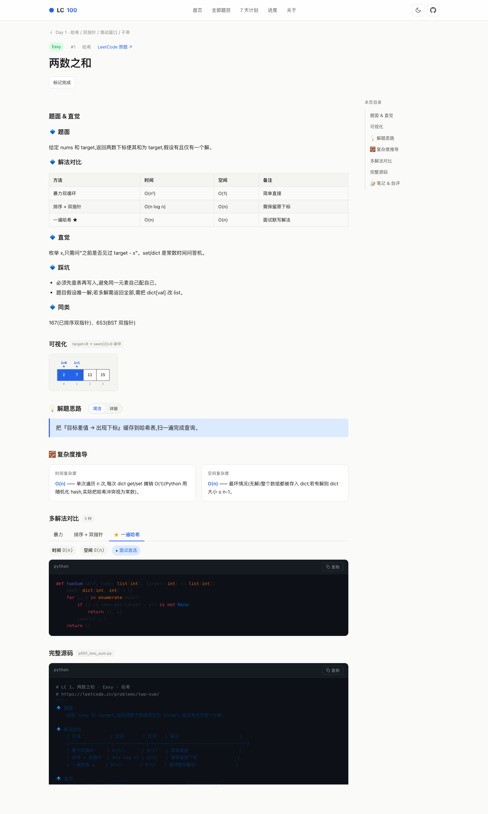 | 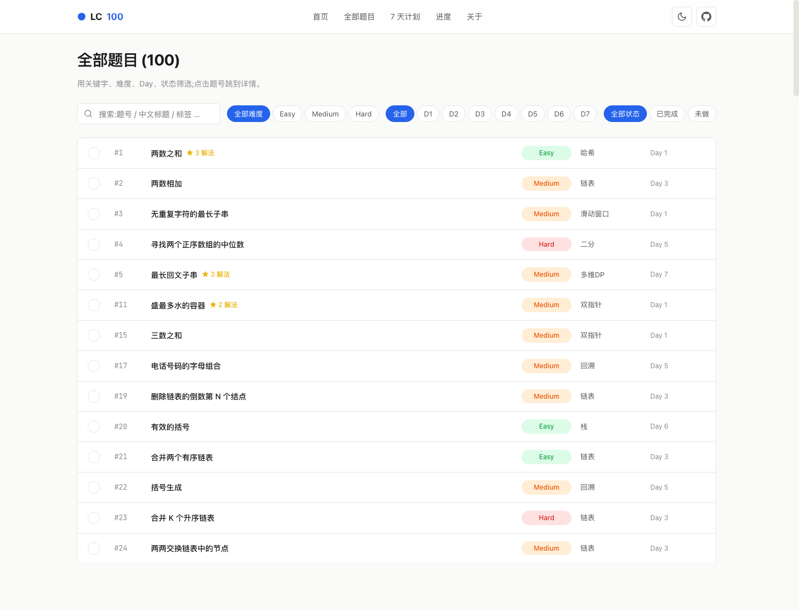 |

| 链表可视化 | 二叉树可视化 | 环形链表 |
| --- | --- | --- |
| 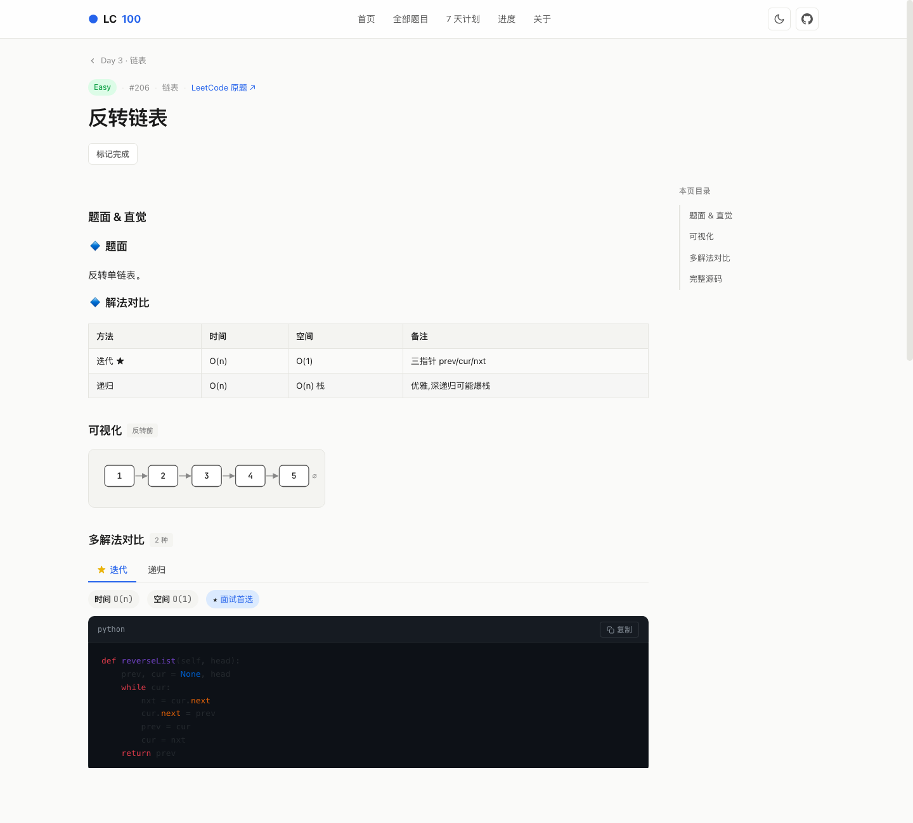 | 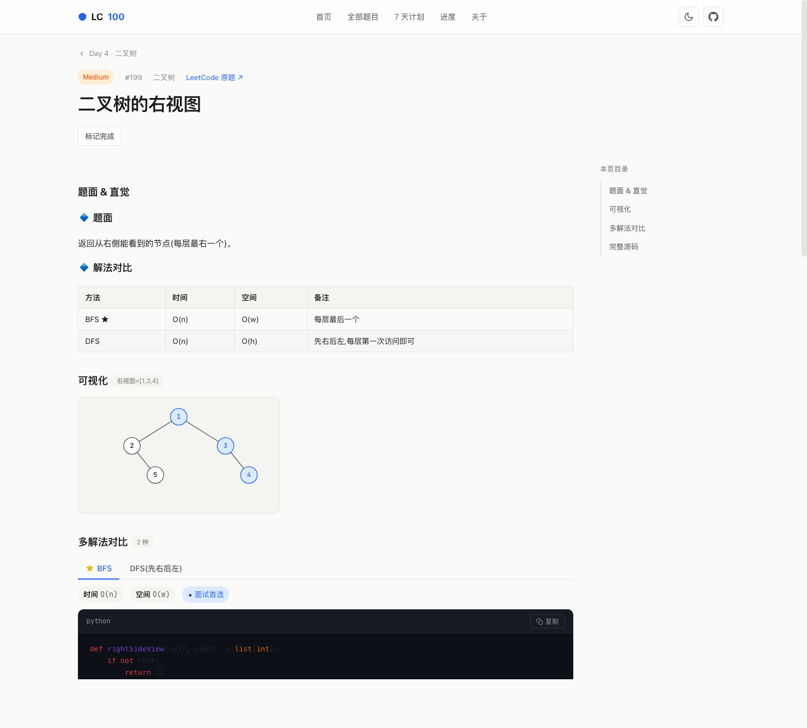 | 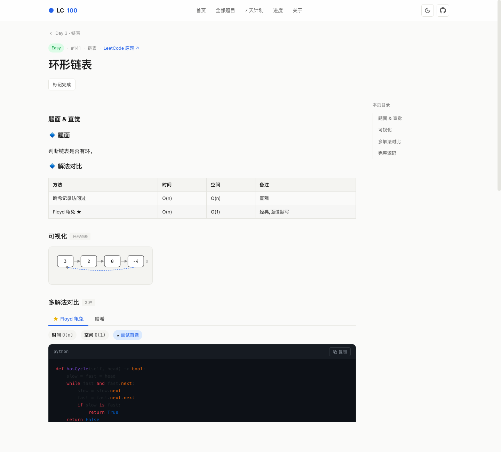 |

| 解题思路·简洁版 | 解题思路·详细版 |
| --- | --- |
| 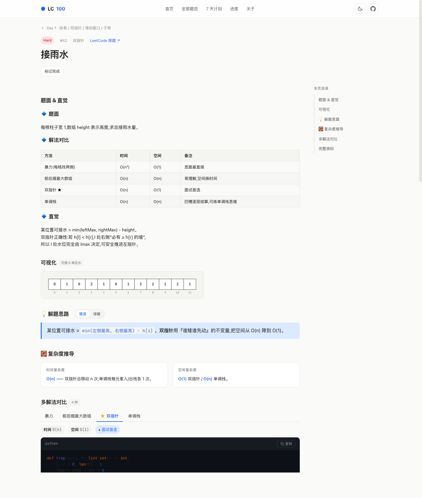 | 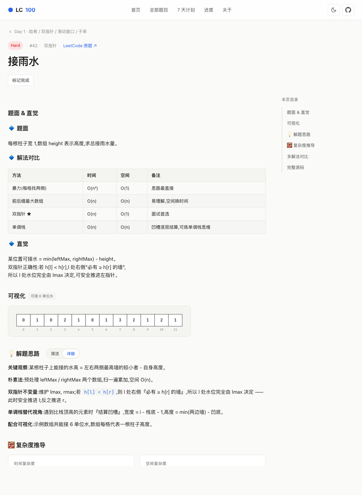 |

| 多帧步骤可视化 | 全文搜索 + 片段高亮 |
| --- | --- |
| 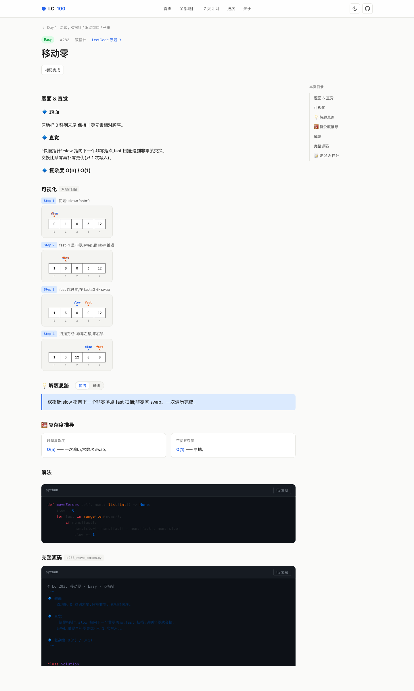 | 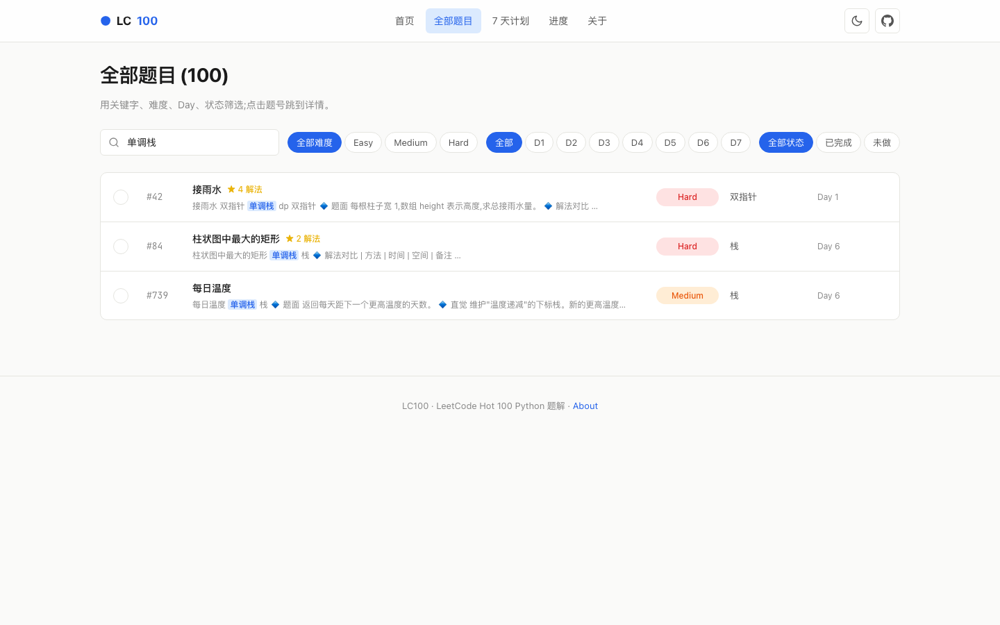 |

| 模式速记 | 进度面板 |
| --- | --- |
| 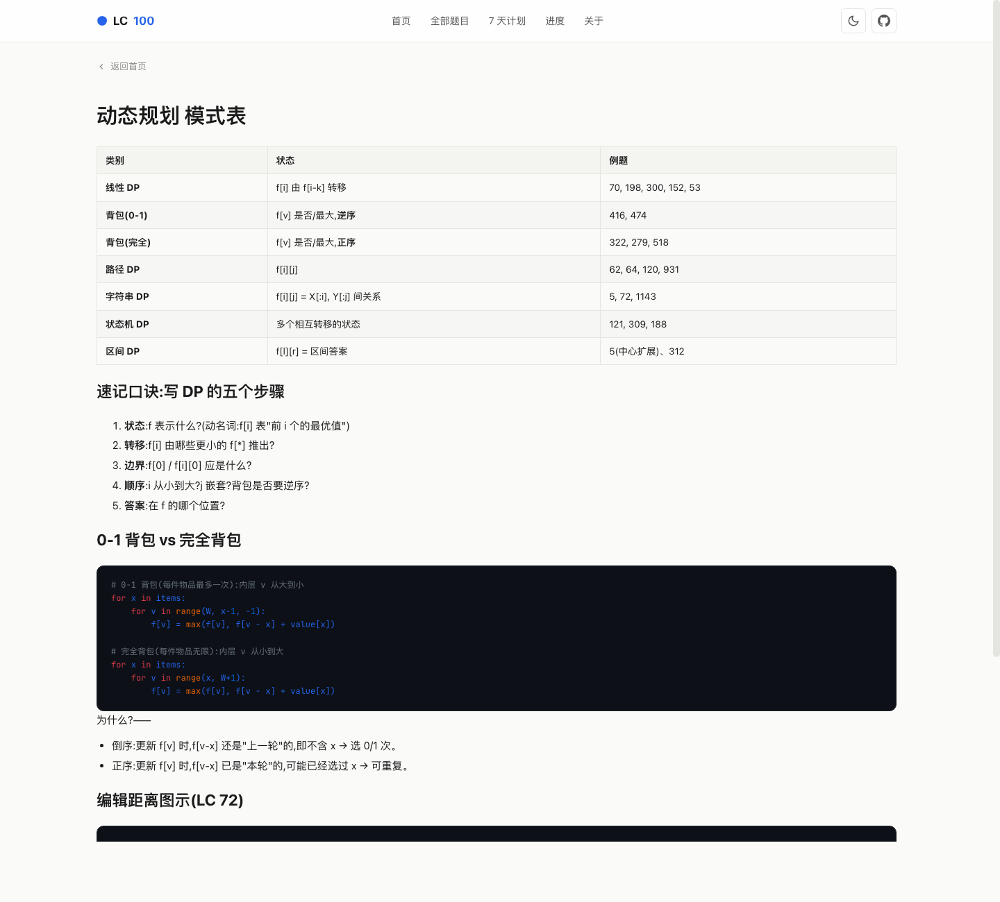 | 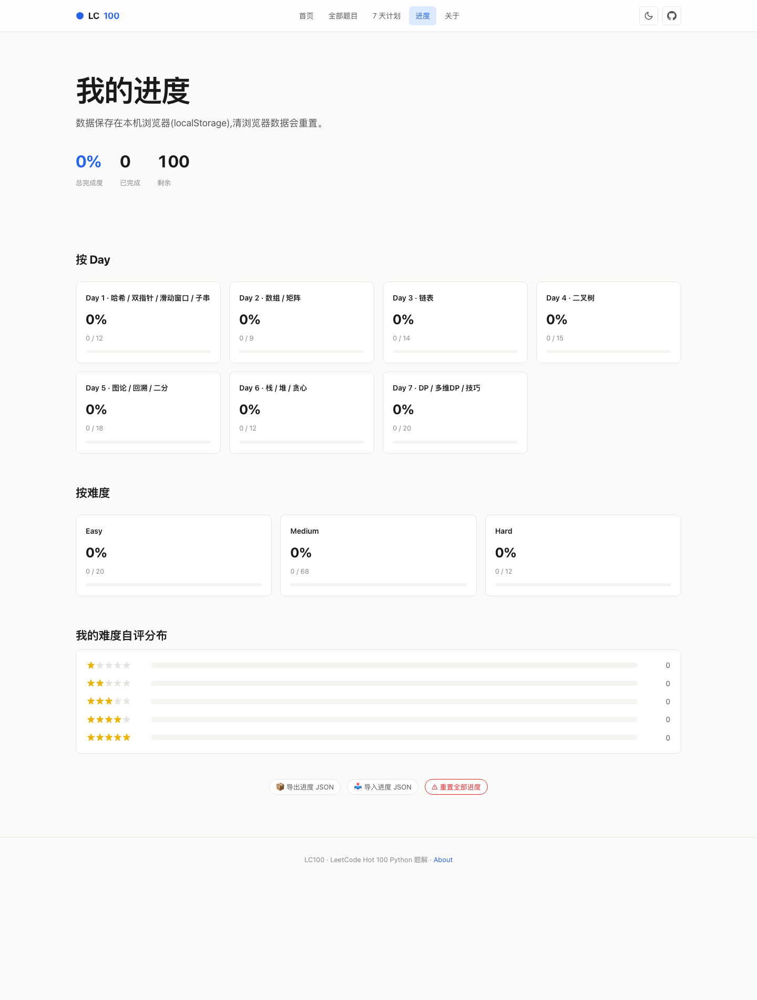 |

## 📁 项目结构

```
lc100/
├── index.html              # SPA 入口
├── 404.html                # GH Pages 404 → SPA 路由
├── .nojekyll               # 关闭 Jekyll(让 _ 开头文件可访问)
├── assets/
│   ├── css/main.css        # 设计系统 + 组件样式
│   └── js/
│       ├── app.js          # 入口,主题/路由/快捷键
│       ├── router.js       # 极简 hash 路由
│       ├── data.js         # 数据加载 + 缓存
│       ├── markdown.js     # 轻量级 Markdown 渲染(表格/代码/列表)
│       ├── views.js        # 所有页面视图
│       └── progress.js     # localStorage 进度
├── data/
│   ├── problems.json       # 100 题摘要索引
│   ├── days.json           # 7 天分组
│   ├── problems/p0001.json # 每题完整数据(题面、多解法、源码)
│   └── patterns/*.md       # 模式速记表(7 张)
├── solutions/              # 完整 .py 源码(可直接下载)
└── scripts/build.py        # 从 hot100/ 解析生成 JSON
```

## 🚀 本地预览

任意静态服务即可。**必须**用 HTTP 而非直接打开 `file://`(因为 fetch 加载 JSON 需要 origin)。

```bash
cd lc100
python3 -m http.server 8000
# 浏览器打开 http://localhost:8000
```

或:

```bash
npx serve .         # 需 Node.js
caddy file-server   # 需 Caddy
```

## ☁️ 部署到 GitHub Pages(repo 名:`lc100`)

> 💡 你的本机已配置 SSH key 并认证为 **`Young-1231`**(`ssh -T git@github.com` 已通过),
> 因此**直接用 SSH** 推送即可,**无需登录**。如果换账号或电脑,见下面 SSH 配置一节。

### 三步部署(SSH)

**第 1 步**:在 GitHub 网页登录 `Young-1231` 账号 → New repository,名字 **`lc100`**,
公共,**不要勾选** "Add README/.gitignore/license"(空仓库)。

**第 2 步**:本地推送

```bash
cd /Users/max/Codefield/lc100
git init -b main
git add .
git commit -m "init: lc100 site"
git remote add origin git@github.com:Young-1231/lc100.git
git push -u origin main
```

**第 3 步**:启用 Pages

打开 `https://github.com/Young-1231/lc100/settings/pages`,选择
- **Source**: `Deploy from a branch`
- **Branch**: `main` / `(root)`
- 点 **Save**

1–3 分钟后访问 **`https://young-1231.github.io/lc100/`** 即可看到上线版本。

> ✨ 仓库已包含 `.github/workflows/pages.yml`,用 GH Actions 部署也行(更专业)。
> 选择 Pages 的 Source 为 `GitHub Actions` 即可触发自动部署。

### SSH 配置(可选,只在换电脑/账号时需要)

```bash
# 生成 key(如已有 ~/.ssh/id_ed25519 跳过)
ssh-keygen -t ed25519 -C "your_email@example.com"
# 把公钥贴到 GitHub
pbcopy < ~/.ssh/id_ed25519.pub        # 复制
# 打开 https://github.com/settings/ssh/new 粘贴
# 测试
ssh -T git@github.com   # 显示 "Hi <user>! You've successfully authenticated"
```

### 用 HTTPS + Personal Access Token(替代方案)

如果 SSH 不可用:

```bash
# 1) 在 https://github.com/settings/tokens 创建 PAT(scope: repo)
# 2) 推送时用户名填 GitHub 账号名,密码填 PAT
git remote add origin https://github.com/Young-1231/lc100.git
git push -u origin main
# (输入用户名 + PAT 一次后会被 macOS Keychain 缓存)
```

## 🔄 内容更新流程

如果你想修改题解或样式,推荐流程:

```bash
# 1. 在 hot100/ 中改 .py 解题文件
vim ../hot100/day1_hash_two_pointer_window/p001_two_sum.py

# 2. 自测全部题目仍然通过
cd ../hot100 && python3 run_all.py

# 3. 重新生成站点 JSON 数据
cd ../lc100 && python3 scripts/build.py

# 4. 提交并推送
git add . && git commit -m "update: p001"
git push
```

## ⌨️ 快捷键

| 键 | 功能 |
| --- | --- |
| `/` | 跳转到全部题目并聚焦搜索 |
| `D` | 切换暗色 / 亮色主题 |
| `Esc` | 返回首页(在题目详情页时) |

## 🧰 解析脚本说明 (`scripts/build.py`)

它把 `../hot100/` 中每个 `p###_xxx.py` 解析成:

- 顶部 `# LC X. 标题 · Difficulty · 标签` 提取元数据
- 模块 docstring 作为题面/直觉/对比表(用站内 markdown 渲染)
- `class Solution` 中每个 `def` 提取为一个解法
  - 若 def 上方有 `# 解法 N:xxx — O(n) / O(1)` 则解析标题/复杂度
  - `★` 标记为面试首选(默认 Tab)

输出:

- `data/problems.json` —— 100 题索引
- `data/days.json` —— 7 天分组
- `data/problems/p0001.json` —— 每题完整数据(题面、解法列表、原始源码)
- `solutions/p001_two_sum.py` —— 原始 .py 拷贝
- `data/patterns/*.md` —— 7 张模式速记表

## 📋 7 天作战计划

| Day | 主题 | 题数 | 关键武器 |
| --- | --- | --- | --- |
| 1 | 哈希 / 双指针 / 滑窗 / 子串 | 12 | dict, Counter, 单调队列, 前缀和+哈希 |
| 2 | 数组 / 矩阵 | 9 | 原地修改, 环状增量, 转置+反转, 模拟 |
| 3 | 链表 | 14 | 哨兵节点, 快慢指针, 三指针翻转, 归并 |
| 4 | 二叉树 | 15 | 递归三件套, 中序, 层序, Morris |
| 5 | 图论 / 回溯 / 二分 | 18 | 并查集, Topo, 子集排列, 红蓝染色 |
| 6 | 栈 / 堆 / 贪心 | 12 | 单调栈, heapq, Top-K, 区间贪心 |
| 7 | DP / 多维DP / 技巧 | 20 | 选/不选, 状态压缩, 滚动数组, Boyer-Moore |
| | **合计** | **100** | |

## 🤝 致谢

- LeetCode 官方 Hot 100 题单
- 灵神(0x3F)的题型分类
- highlight.js (代码高亮)
- 你正在看的这份项目代码 ✨

## 📜 License

MIT

---

Made with care · Python 3.10+ · Vanilla JS · No build step
